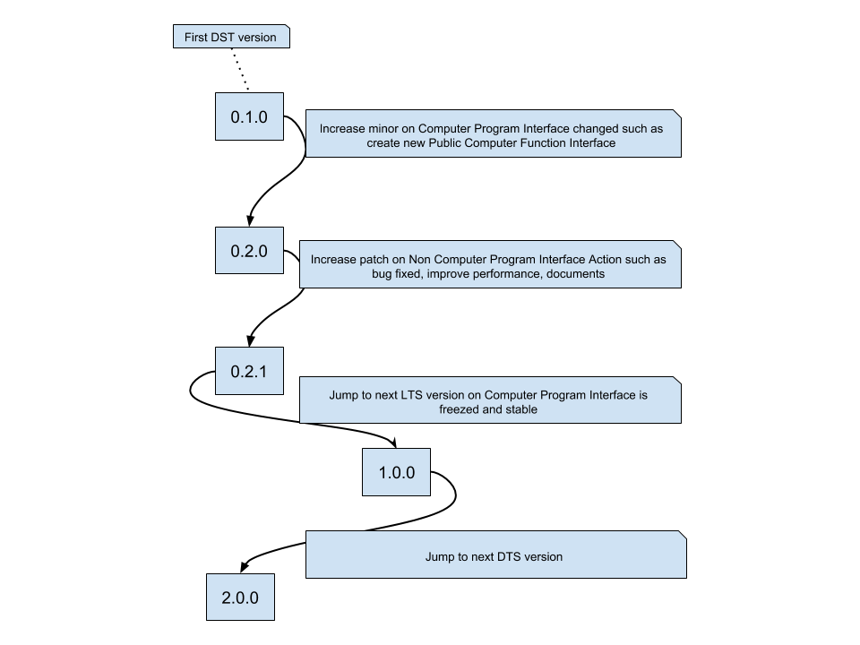

# Introduction

## What it is?

* This is the rules to name Computer Program's version.

## Why it is important?

* `CPI` is Computer Program Intefrace, it represents for the ways to use
  program.  For example, `API` - Application Programming Inteface, `UI` - User
  Inteface, `CLI` - Command Line.
* On the world of Computer Program, dependency between program-program is
  complex. Should program A depends on program B, version X?. Should program A
  upgrades dependency of B from version X to Y? Without versioning, the only
  way is read `CPI` of program B, it is painful and almost impossible.

## How it works?

* A version has format like this `major.minnor.patch`, where all of components
  is unsigned integer number, begin from `0`, for example `1.2.3`.
* There are two kind of version, `DTS` - Development Term Support and `LTS` -
  Long Term Support.
* `DTS` come with even `major`, for example `0.1.0`.  `minnor` represents for
  `CPI` changes which is not guarantee to backward compatible with previous,
  for example `0.2.0` is not guarantee to backward compatible with `0.1.0`.
  The reason is on development, we have no idea How `CPI` look like, it
  requires time to design, implement and testing. If program A depends on
  program B, version `0.1.0` then we can upgrade program B to version
  `0.2.0` with cost: careful reading change log document and rewrite few
  parts or all of program A.
* `LTS` come with odd `major`, for example `1.0.0`. `minnor` represents for
  `CPI` changes which is backward compatible with previous versions, for
  example `1.2.0` is backward compatible with `1.1.0`.  The reason is `LTS`
  must reduce maintain cost.  If program A depends on program B, version
  `1.2.0` then we can upgrade program B to version `1.3.0` without any worry
  about rewrite program A.
* `patch` represents for non `CPI` changes such as implementation of an
  algorithm, fix bugs, performance improvement or upgrade documents, for
  example `1.2.0` and `1.2.1` has the similar `CPI`.

## Do we have specification for this?

Yes, ofcourse, checkout [Concepts](concept.md) and [Rules](rule.md).
